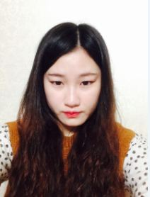

#RESUME

**이름** : 장은아

**나이** : 21

**학과** : 제주대학교 컴퓨터공학과

**E-MAIL** : [dmsdk2121@gmail.com]

**GITHUB**: [jangeuna.github.io](http://github.com/Eun-A)

>__안녕하세요!__  컴퓨터공학과 2학년 재학중인 장은아 입니다.
 
제주신성여고를 졸업해서 2014년에 제주대학교 컴퓨터공학과에 입학하게 되었습니다.
 
현재 Java 언어와 c++ 공부를 하고 있고 개발언어에 관심이 있습니다.
 
저는 다른 사람의 말을 경청하며 타인의 의견을 이해하고 존중하려합니다.
 
또한 저는 성실함과 책임감 있는 사람입니다. 약속을 잘 지키며 조별과제가 있으면 저에게 주어진 역할에 대해서는 완벽히 해내고 다른 조원의 임무를 도와주며 더 좋은 결과물을 내게 합니다.
 
아직 기본적인 프로그래밍 실력이지만 서로 알려주고 도와가면서 한다면 좋은 결과가 있을것이라고 생각합니다.

>###LANGUAGUE

* C
* C++
* JAVA
* PHP
* HTML

>###INTERESTS

* 음악감상
* 자전거타기
* 영화감상
* 등산
